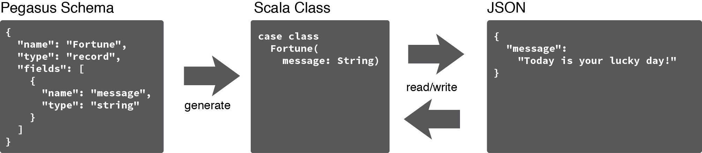
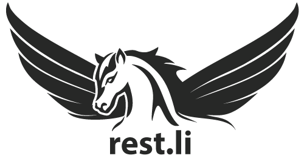

Courier
-------

Courier is a Scala data binding generator for the Pegasus schema language.

The Scala classes generated by Courier efficiently serialize/deserialize to JSON.

  

For more details, see: https://github.com/coursera/courier

Subspace
--------

A lightweight vector and matrix math library for OpenGL programming in Scala.

Inspired by glm, Subspace handles the graphics programming vector and matrix computations that often need to be performed on the CPU. It provides convenience features inspired by shader programming language like swizzle operators as well as a comprehensive set of core operations, including replacements for operations that have been deprecated by OpenGL such as a convenient routine for building a perspective transformation matrix.

Is intended for use with OpenGL, via JVM bindings such as LWJGL, but could be used with any graphics API.

For more details, see: http://jpbetz.github.io/subspace/

Rest.li
-------

Rest.li is an open source REST framework for building robust, scalable RESTful architectures using type-safe bindings and asynchronous, non-blocking IO. Rest.li fills a niche for applying RESTful principals at scale with an end-to-end developer workflow for buildings REST APIs that promotes clean REST practices, uniform interface design and consistent data modeling.

  

For more details, see: https://github.com/linkedin/rest.li
